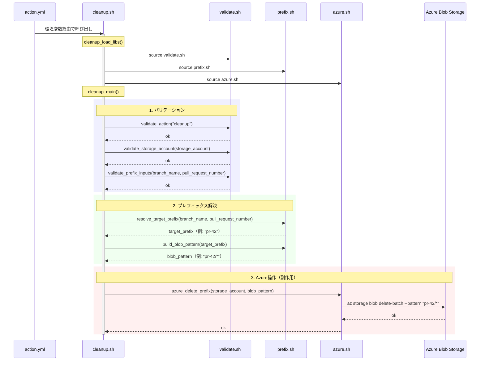
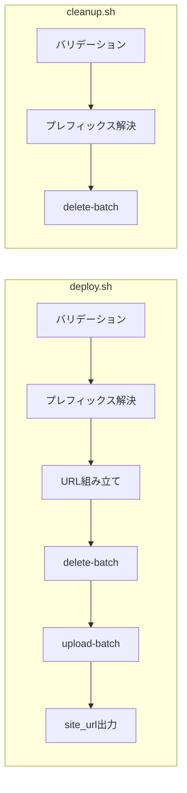

# cleanup.sh 設計

## 概要

`scripts/cleanup.sh` は `action.yml` から `action=cleanup` 時に呼び出されるエントリーポイントスクリプト。対象プレフィックス配下のBlobを全削除する。主にPRクローズ時のステージング環境削除に使用される。

## 入力

環境変数または関数引数で受け取る。環境変数は `action.yml` が `inputs` からマッピングする。

| 優先順位 | 関数引数 | 環境変数 | 説明 |
|----------|----------|----------|------|
| 1 | `$1` | `INPUT_STORAGE_ACCOUNT` | Azure Storageアカウント名 |
| 2 | `$2` | `INPUT_BRANCH_NAME` | ブランチ名 |
| 3 | `$3` | `INPUT_PULL_REQUEST_NUMBER` | PR番号 |
| 4 | `$4` | `INPUT_ACTION` | 実行種別（デフォルト: `cleanup`） |

## 出力

- 標準出力: なし（`deploy.sh` と異なり `site_url` を返さない）

## 処理フロー

### シーケンス図



### deploy.sh との比較



`cleanup.sh` は `deploy.sh` のサブセットであり、以下が不要となる。

- `source_dir` のバリデーション（アップロード対象がない）
- URL組み立て（出力URLを返さない）
- `azure_upload_dir`（アップロードしない）

### 処理ステップの詳細

#### 1. バリデーション（validate.sh）

`deploy.sh` と同じバリデーション関数を使用するが、`validate_source_dir` は呼び出さない（`source_dir` が不要なため）。

| 関数 | 検証内容 |
|------|----------|
| `validate_action` | `deploy` または `cleanup` であること |
| `validate_storage_account` | 3〜24文字の小文字英数字であること |
| `validate_prefix_inputs` | `branch_name` または `pull_request_number` のいずれかが有効であること |

#### 2. プレフィックス解決（prefix.sh）

`deploy.sh` と同じロジックで `target_prefix` を決定する。URL組み立ては行わない。

- `resolve_target_prefix`: `pull_request_number` 優先で `pr-<番号>` を生成
- `build_blob_pattern`: 削除対象のglobパターン生成（例: `pr-42/*`）

#### 3. Azure操作（azure.sh）

`azure_delete_prefix` のみを実行する。

- `az storage blob delete-batch` で `$web` コンテナ内の対象パターンに一致するBlobを全削除
- `--auth-mode login` でOIDC認証を使用

## エラーハンドリング

`deploy.sh` と同様のエラーハンドリング方式。

- 各ステップで `|| return 1` によりエラーを呼び出し元に伝播する
- スクリプト直接実行時は `set -euo pipefail` で未定義変数参照やパイプエラーも即座に終了
- バリデーションエラーはAzure操作の前に検出される

## 典型的な利用シナリオ

```yaml
# PRクローズ時にステージング環境を削除
cleanup:
  if: github.event_name == 'pull_request' && github.event.action == 'closed'
  steps:
    - uses: nuitsjp/azure-blob-storage-site-deploy@v1
      with:
        action: cleanup
        storage_account: ${{ vars.AZURE_STORAGE_ACCOUNT }}
        pull_request_number: ${{ github.event.pull_request.number }}
```

この場合の内部処理:
1. `pull_request_number: "42"` → `target_prefix: "pr-42"`
2. `blob_pattern: "pr-42/*"`
3. `az storage blob delete-batch --pattern "pr-42/*"` で `$web/pr-42/` 配下を全削除

## テスト方式

フローテスト（`tests/flow/test_cleanup.bats`）では `tests/helpers/mock_azure.sh` で `az` コマンドをモック化し、以下を検証する。

- `pull_request_number` 指定時に `pr-<number>` パターンで delete-batch が実行されること
- `branch_name` 指定時にブランチ名パターンで delete-batch が実行されること
- delete-batch のみが1回だけ呼ばれること（upload-batch は呼ばれない）
- バリデーションエラー時にAzure操作が呼ばれないこと
