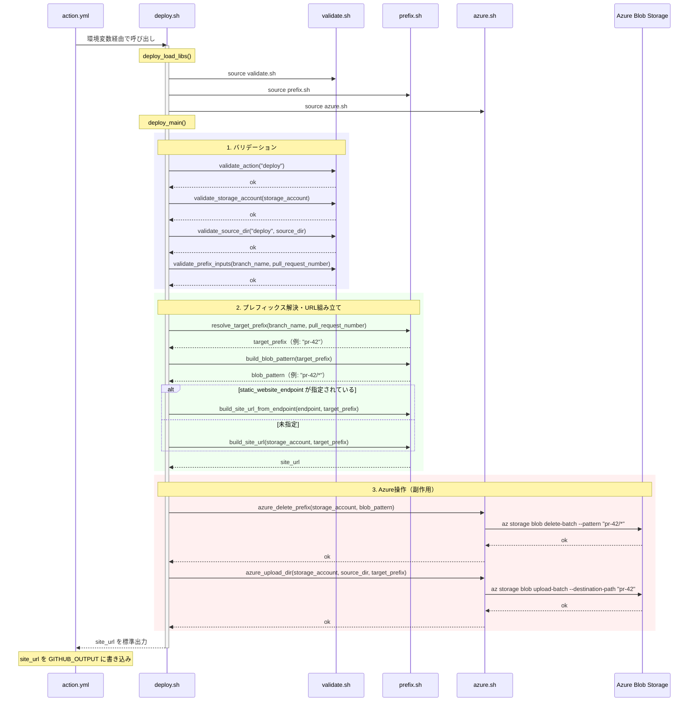

# deploy.sh 設計

## 概要

`scripts/deploy.sh` は `action.yml` から `action=deploy` 時に呼び出されるエントリーポイントスクリプト。対象プレフィックス配下の既存ファイルを全削除した後、ソースディレクトリの内容をアップロードし、配置先URLを標準出力に返す。

## 入力

環境変数または関数引数で受け取る。環境変数は `action.yml` が `inputs` からマッピングする。

| 優先順位 | 関数引数 | 環境変数 | 説明 |
|----------|----------|----------|------|
| 1 | `$1` | `INPUT_STORAGE_ACCOUNT` | Azure Storageアカウント名 |
| 2 | `$2` | `INPUT_SOURCE_DIR` | アップロード対象ディレクトリ |
| 3 | `$3` | `INPUT_BRANCH_NAME` | ブランチ名 |
| 4 | `$4` | `INPUT_PULL_REQUEST_NUMBER` | PR番号 |
| 5 | `$5` | `INPUT_ACTION` | 実行種別（デフォルト: `deploy`） |
| 6 | `$6` | `INPUT_STATIC_WEBSITE_ENDPOINT` | カスタムエンドポイントURL |

## 出力

- 標準出力: 配置先URL（末尾スラッシュ付き）
  - 例: `https://examplestorage.z22.web.core.windows.net/pr-42/`
- `action.yml` が標準出力の最終行を `site_url` として `GITHUB_OUTPUT` に書き込む

## 処理フロー

### シーケンス図

### 処理ステップの詳細

#### 1. バリデーション（validate.sh）

すべての入力値を検証し、不正な場合は即座にエラーで終了する。Azure操作の前にフェイルファストすることで、不要なAPI呼び出しを防ぐ。

| 関数 | 検証内容 |
|------|----------|
| `validate_action` | `deploy` または `cleanup` であること |
| `validate_storage_account` | 3〜24文字の小文字英数字であること |
| `validate_source_dir` | `action=deploy` 時に存在するディレクトリであること |
| `validate_prefix_inputs` | `branch_name` または `pull_request_number` のいずれかが有効であること |

#### 2. プレフィックス解決・URL組み立て（prefix.sh）

`branch_name` と `pull_request_number` からデプロイ先プレフィックスを決定し、関連するパターンとURLを組み立てる。

- `resolve_target_prefix`: `pull_request_number` 優先で `pr-<番号>` を生成、なければ `branch_name` をそのまま使用
- `build_blob_pattern`: 削除対象のglobパターン生成（例: `pr-42/*`）
- `build_site_url` / `build_site_url_from_endpoint`: 配置先URL生成（末尾スラッシュ保証）

#### 3. Azure操作（azure.sh）

既存ファイル削除→新規アップロードの順で実行する「クリーンデプロイ」方式。

1. **`azure_delete_prefix`**: `az storage blob delete-batch` で対象プレフィックス配下を全削除
2. **`azure_upload_dir`**: `az storage blob upload-batch` でソースディレクトリの内容をアップロード

この順序により、ファイル名変更や削除が確実にBlob側に反映される。

## エラーハンドリング

- 各ステップで `|| return 1` によりエラーを呼び出し元に伝播する
- スクリプト直接実行時は `set -euo pipefail` で未定義変数参照やパイプエラーも即座に終了
- バリデーションエラーはAzure操作の前に検出されるため、不完全な状態のデプロイは発生しない

## テスト方式

フローテスト（`tests/flow/test_deploy.bats`）では `tests/helpers/mock_azure.sh` で `az` コマンドをモック化し、以下を検証する。

- delete-batch → upload-batch の実行順序
- 各コマンドに渡される引数（アカウント名、パターン、ソースディレクトリ、プレフィックス）
- バリデーションエラー時にAzure操作が呼ばれないこと
- `static_website_endpoint` 指定時の出力URL
